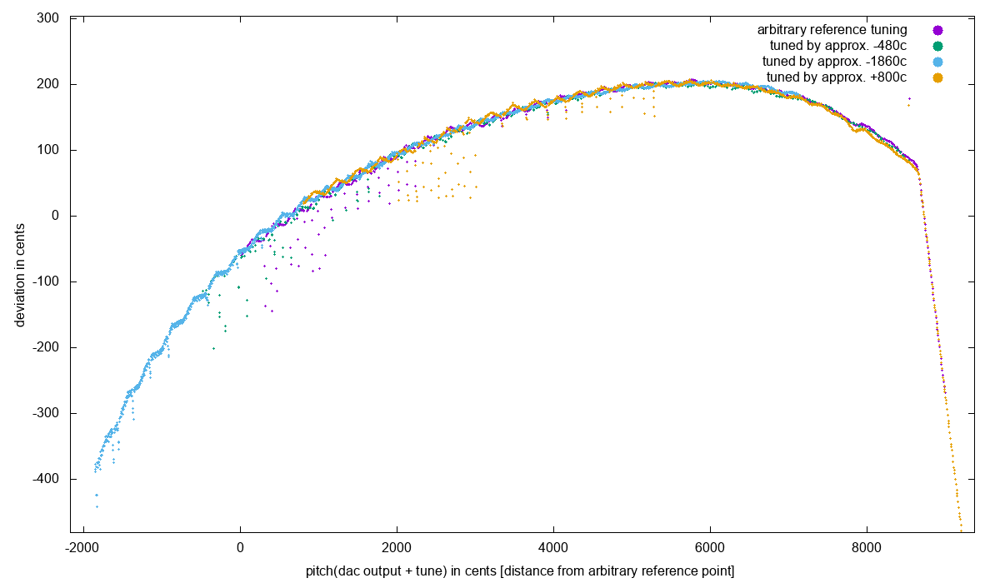

Attributing errors to the DAC and to the remaining circuitry
============================================================

The frequency deviation plots show some systematic error in frequency:

First, there is a wiggle every 64 code points or so. Second, the curve
is bowl-shaped, i.e. the volt-per-octave behaviour is not constant over
the whole DAC range. Instead, it approaches a maximum, and at the left and
right of that maximum, the frequency drops flat.

It shall evaluated which of these artifacts can be attributed to the DAC
and which are to be attributed to the remaining circuitry behind the dac.

Experimental setup
------------------

Schematic and firmware from `6a28ec80e1b361b0f84615ae8e1e478800edd393`
are used. The tune pot R10 is initially adjusted so that the full range
up to the VCO's highest frequency is covered by the DAC's range. The
frequency curve was recorded into `run1.txt`.

Then, the tune pot was tuned down (`run2.txt`), even more down (`run3.txt`),
and way up (so that the high frequencies are clipped, `run4.txt`).

The resulting deviation curves are then moved along the graph (it's valid to
move a curve right by X if you move it down by the same amount X) so that
they match each other as good as possible. The shift amounts are equal to the
tuning caused by the tune pot, and are roughly consistent with the interval
I could hear while tuning.

Expectation
-----------

Any error caused by the DAC should not align across the four curves after
having them aligned as described above. Instead, it should align when
the curves are not moved in X direction. _(Reason: This error would depend
on which code point was sent to the DAC, and not on which voltage went
through U8)_

Any error caused by the circuitry behind the DAC (i.e. expo converter and VCO)
should align across the four curves. _(Reason: It does not depend on the code
point, but solely on the voltage at U8)_

Results
-------

The wiggle does not align. Instead, one can easily verify (not shown)
that the wiggle would align perfectly, if the X axis would show the code point,
not something proportional to the voltage through U8.

**The wiggle is a DAC linearity error and must be compensated for in firmware.**

The overall frequency deviation perfectly aligns across the four curves.
**While it can be compensated for in firmware, it should be adressed in the
analog circuitry. Otherwise, no precise 1v/oct operation with external
(uncompensated) control voltages is possible.**
